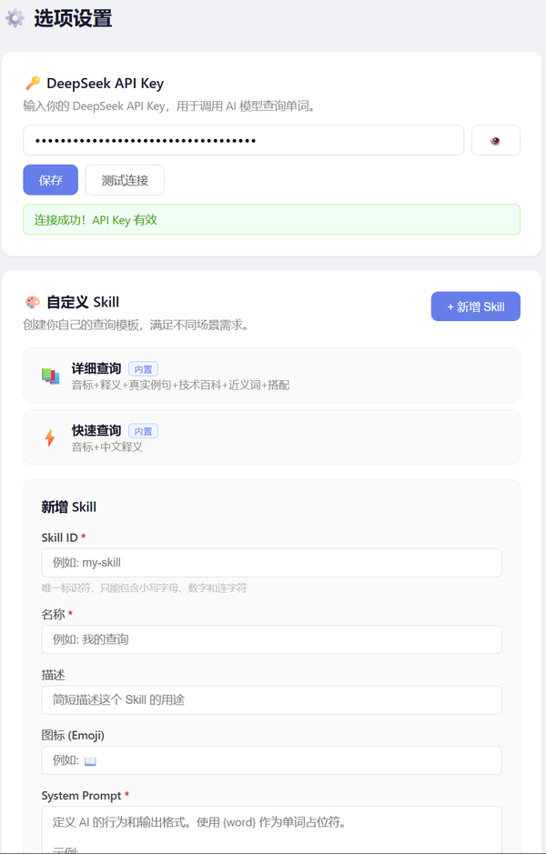
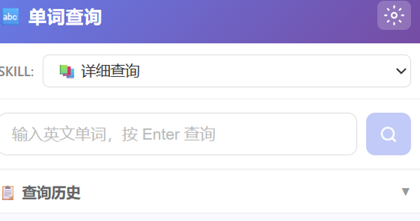

# Word

Chrome extension that looks up English words via the DeepSeek Chat API. Returns phonetics, definitions, example sentences, and tech summaries for domain terms.

[中文](README.md)

<p align="center">
  
  
</p>

## Installation

### Step 1: Get the code

**Option A — Download ZIP (recommended)**

1. Open this repo on GitHub
2. Click the green **Code** button (top-right)
3. Select **Download ZIP**
4. Unzip to any folder on your computer

**Option B — Git clone**

```bash
git clone https://github.com/1829317945/word.git
```

### Step 2: Load into Chrome

1. Open Chrome
2. Go to `chrome://extensions` (or `edge://extensions` for Edge)
3. Turn on the **"Developer mode"** toggle (top-right corner)
4. Click **"Load unpacked"** (top-left)
5. In the file picker, select the `word` folder you extracted in Step 1 — make sure it's the folder containing `manifest.json`, not its parent
6. Click "Select folder"

The Word icon will appear in your extensions list. Click the pin 📌 to keep it visible on the toolbar.

### Step 3: Configure API Key

1. Go to [platform.deepseek.com/api_keys](https://platform.deepseek.com/api_keys)
2. Sign up or log in, then click **"Create API Key"** — copy the key (it starts with `sk-`)
3. Click the Word extension icon → ⚙️ gear icon → paste the key → click **"Save"**
4. Click **"Test Connection"** — a green success message means everything is set

> **Cost**: DeepSeek Chat API bills per token. A single lookup costs a fraction of a cent. Casual daily use is effectively free.

### Troubleshooting

<details>
<summary><b>Extension icon not showing?</b></summary>
Click the puzzle piece 🧩 on the toolbar, find Word in the list, click the pin 📌. If it's not in the list either, check <code>chrome://extensions</code> to make sure the extension is enabled.
</details>

<details>
<summary><b>"Invalid API Key" when testing?</b></summary>
Check: ① Is the key copied in full (starts with <code>sk-</code>)? ② Does your DeepSeek account have credits? ③ New accounts usually get free quota — try creating a fresh key.
</details>

<details>
<summary><b>"Network error" when searching?</b></summary>
Confirm you're connected to the internet. Some corporate/school networks may block <code>api.deepseek.com</code> — try a different network.
</details>

<details>
<summary><b>Search stuck loading?</b></summary>
API responses typically take 3–10 seconds. If it exceeds 30 seconds, close and reopen the popup, then try again.
</details>

## Usage

1. Click the Word icon on the toolbar
2. Pick a Skill from the dropdown (default: "详细查询")
3. Type an English word, press **Enter**
4. Click 🔊 to hear pronunciation
5. Use the history panel at the bottom to revisit past lookups (last 20)

## Built-in Skills

| ID | Name | Output |
|----|------|--------|
| `detailed` | 详细查询 | Phonetics · definition · category · tech summary · examples (with sources) · synonyms · collocations |
| `quick` | 快速查询 | Phonetics · Chinese definition |

The **Detailed** skill classifies each word as `general`, `tech`, or `academic`. For IT, AI, and CS terms it generates an 80–150 word Wikipedia-style technical summary. All examples cite their real-world source.

## Custom Skills

Open the options page (⚙️) to create, edit, or delete custom Skills. Each Skill consists of a system prompt template (use `{word}` as the placeholder) and a list of output field definitions.

> The system prompt must contain the word "json" (case-insensitive). The extension appends it automatically if missing, but including it in your prompt avoids API rejections.

## Project Structure

```
├── manifest.json          # Chrome MV3 manifest
├── popup/                 # Popup interface
├── options/               # Options page (API Key + Skill CRUD)
├── lib/
│   ├── deepseek.js        # DeepSeek API client
│   ├── storage.js         # chrome.storage.local wrapper
│   ├── skills.js          # Skill merging & validation
│   └── tts.js             # Web Speech API (TTS)
├── skills/presets.js      # Built-in Skills (2)
└── icons/                 # Extension icons
```

## Tech

- Chrome Extension Manifest V3, ES Modules, zero build step
- `deepseek-chat` model, `response_format: json_object`, temperature 0.3
- `chrome.storage.local` for API key, custom skills, lookup history (FIFO max 20)
- Web Speech API (`SpeechSynthesisUtterance`), playback rate 0.9x

## License

MIT
